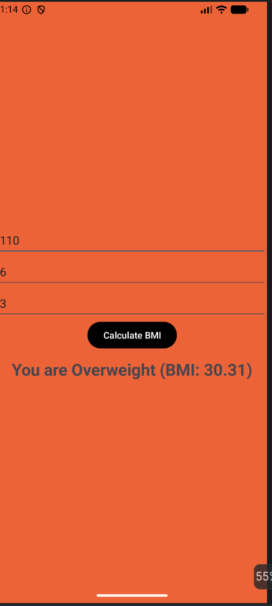

# BMI Calculator Android App

A simple and intuitive Body Mass Index (BMI) calculator for Android. This app calculates your BMI based on weight (kg) and height (feet/inches) and provides instant visual feedback by changing the background color according to the result.

## Features
- **Real-time Calculation**: Instant BMI results with a single click.
- **Dynamic UI**: Background color changes based on the BMI category:
  - 🟢 **Green**: Healthy Weight
  - 🟡 **Yellow**: Underweight
  - 🟠 **Orange**: Overweight
- **User Friendly**: Automatically hides the keyboard after calculation for a clear view of the result.
- **Input Validation**: Prevents crashes by validating empty or invalid inputs.

## Screenshot


## How to use
1. Enter your weight in Kilograms (kg).
2. Enter your height in Feet and Inches.
3. Tap on the **Calculate BMI** button.
4. View your BMI score and health category with the dynamic background.

## Technologies Used
- **Language**: Java
- **UI**: XML / LinearLayout
- **Minimum SDK**: API 24+

## Installation
1. Clone the repository:
   ```bash
   git clone https://github.com/dkgtech5/Androidapps.git
   ```
2. Open the project in Android Studio.
3. Build and run on an emulator or physical device.
